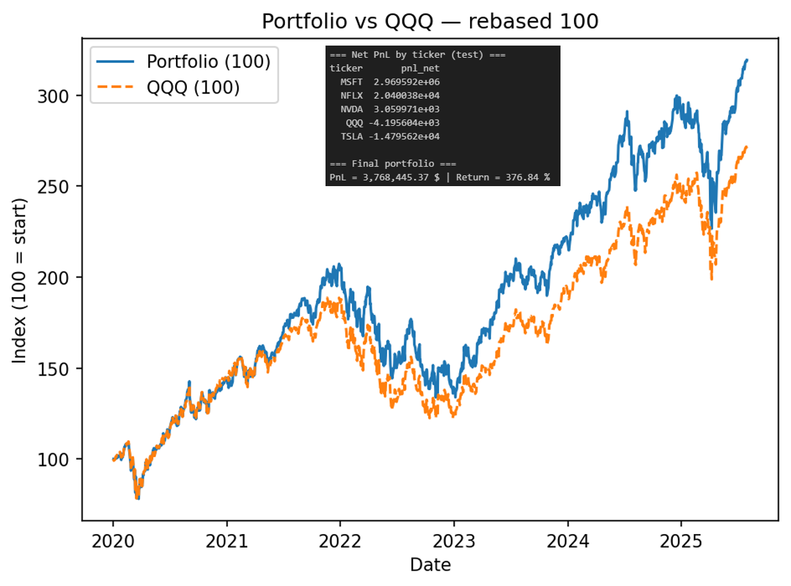
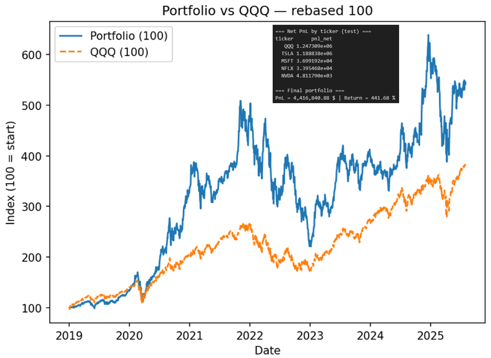

# FinRL-Hybrid

Hybrid Deep Reinforcement Learning for Trading:

- **FinRL** environment for data/indicators/trading env  
- **Soft Actor–Critic (SAC)** via Stable-Baselines3  
- **Kalman pairs** (dynamic hedge ratio) for mean reversion  
- Optional **Recurrent PPO (LSTM)** regime score (sb3-contrib)  
- **Fusion**: SAC & Kalman actions mixed, gated by regime score

> Research/education only. Not financial advice.

---

## Model Overview — What the Hybrid Approach Brings

This model integrates three complementary layers to make trading more adaptive, interpretable, and robust across changing market conditions.

### 1) Learning + Structure Combined

- Soft Actor–Critic (SAC) learns continuous actions directly from market data, capturing nonlinear dynamics and momentum effects.  
- Kalman pairs trading provides a model-based anchor: a dynamic hedge ratio βₜ between correlated assets and mean-reversion signals from the spread’s z-score.  

Together, they blend deep RL flexibility with a more structural market equilibrium logic.

### 2) Regime Awareness (optional)

A Recurrent PPO–LSTM module can produce a regime score \( rₜ ∈ [-1, 1] \) reflecting current market behavior (trend ↔ mean reversion).  
This score continuously modulates the mix between SAC and Kalman actions:


```math

a_{\text{final}}
= w_{\text{SAC}}(r_t)\, a_{\text{SAC}}
+ w_{\text{Kalman}}(r_t)\, a_{\text{Kalman}},\qquad r_t \in [-1,1]

```


The policy naturally adapts to changes in volatility, directionality, and liquidity.

### 3) Stability and Interpretability

- The model-based (Kalman) pillar limits erratic RL behavior and acts as a safety net.  
- Each component (SAC, Kalman, regime) is traceable, improving analysis and explainability.  
- More controlled exposures → smoother PnL and contained drawdowns.

### 4) Full Evaluation Pipeline

- Periodic PnL during training (callbacks)  
- Per-ticker PnL and cumulative curves  
- Transaction costs and trade markers  
- Portfolio value & benchmark comparison plots  
- Automatic exports under `fig/` (CSV + PNG)

---

##  Results

Below are some sample results from the hybrid FinRL–Kalman–SAC–LSTM pipeline.

### Stable Mode


---

### Aggressive Mode



\##  Architecture

```
[Market Data] → [FinRL Env + Features] → SAC ┐ ├──> Fusion (regime-gated) → Δshares → Evaluation & Plots  
[Kalman pairs (βₜ)] ───────┘ (optional) RecurrentPPO-LSTM → Regime score rₜ ∈ [−1,1]
```
##  Quickstart

```bash
# 1) Clone & create env
python -m venv .venv && source .venv/bin/activate  # Windows: .venv\Scripts\activate
pip install -r requirements.txt
```

# 2) Run the hybrid script (defaults from the file)

```bash

python run\_hybrid\_trader.py

```

Outputs are saved under fig/ (CSV + PNG).


## Repository layout

```

FinRL\_Kalman\_SAC\_LSTM/

├─ README.md

├─ requirements.txt

├─ LICENSE

├─ .gitignore

├─ run\_hybrid\_trader.py # your main script (see skeleton below)

├─ fig/ # auto-created outputs (ignored by git)

└─ .github/

└─ workflows/

└─ ci.yml # optional CI (lint + import check)

```


## What you get


- Periodic PnL on test env during training (callbacks)

- Per-ticker PnL (CSV + plot)

- Account value \& PnL curves

- Trade markers on a chosen ticker

- Summary CSV (fig/summary\_pnl.csv)


## Main flags


- ```--use-kalman/--no-kalman``` — enable Kalman pairs leg

- ```--use-sac/--no-sac``` — enable SAC agent

- ```--use-ppo-lstm/--no-ppo-lstm``` — compute regime score if sb3-contrib available

-  ```--spread-bps, --fee-bps — costs; --eps-trade``` — min abs(Δshares) to execute


## Repro tips


- Increase ```--sac-steps``` for better convergence on full runs

- Pin your environment with ```pip freeze > requirements.lock.txt```

- Use TensorBoard via SB3 if you add logging (```--tensorboard-log tb\_logs```)


## Citations \& Acknowledgements

Built on FinRL and Stable-Baselines3/sb3-contrib. Please cite their work per their repos. This code is for research/education only.


# 3) LICENSE (MIT)

MIT License


Permission is hereby granted, free of charge, to any person obtaining a copy

of this software and associated documentation files (the "Software"), to deal

in the Software without restriction, including without limitation the rights

to use, copy, modify, merge, publish, distribute, sublicense, and/or sell

copies of the Software, and to permit persons to whom the Software is

furnished to do so, subject to the following conditions:


The above copyright notice and this permission notice shall be included in all

copies or substantial portions of the Software.


THE SOFTWARE IS PROVIDED "AS IS", WITHOUT WARRANTY OF ANY KIND, EXPRESS OR

IMPLIED, INCLUDING BUT NOT LIMITED TO THE WARRANTIES OF MERCHANTABILITY,

FITNESS FOR A PARTICULAR PURPOSE AND NONINFRINGEMENT. IN NO EVENT SHALL THE

AUTHORS OR COPYRIGHT HOLDERS BE LIABLE FOR ANY CLAIM, DAMAGES OR OTHER

LIABILITY, WHETHER IN AN ACTION OF CONTRACT, TORT OR OTHERWISE, ARISING FROM,

OUT OF OR IN CONNECTION WITH THE SOFTWARE OR THE USE OR OTHER DEALINGS IN THE

SOFTWARE.


